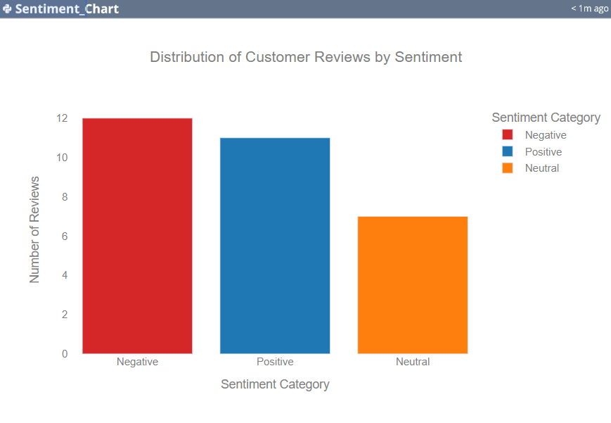

# SENTIMENT-ANALYSIS

*COMPANY*: CODTECH IT SOLUTIONS

*NAME*: PABITRA SAHOO

*INTERN ID*: CT04DF1804

*DOMAIN*: DATA ANALYST

*DURATION*: 4 WEEKS

*MENTOR*: NEELA SANTOSH

## TASK DESCRIPTION

📌 Project Overview
This project was developed as part of my Data Analyst internship to demonstrate the application of Natural Language Processing (NLP) techniques for Sentiment Analysis. The objective was to extract insights from textual data—in this case, customer reviews—and determine whether they express positive or negative sentiments.

By analyzing customer feedback using Python's NLP libraries and visualization tools, I was able to process, analyze, and represent the sentiments in an interactive and comprehensible manner. The project was completed using Jupyter Notebook and showcases various essential stages of a typical data science project: data preprocessing, feature engineering, model implementation, and insight generation.

📁 Dataset
The dataset consists of customer reviews collected from an e-commerce platform. Each record includes a textual review along with its corresponding sentiment label (positive/negative). The reviews are in English and are unstructured in nature.

🧰 Tools & Libraries Used
Python

Pandas – For data manipulation and cleaning

NumPy – For numerical computations

Matplotlib & Seaborn – For data visualization

NLTK / TextBlob / Scikit-learn – For text preprocessing and sentiment analysis

## Visualization & Dashboard

💡 Key Insights
The majority of customer reviews were positive, indicating general customer satisfaction.

Negative reviews commonly mentioned issues related to delivery delays or product quality.

Word frequency analysis showed that words like “great”, “fast”, “perfect” dominated positive reviews, while “bad”, “late”, “poor” were common in negative ones.

Simple logistic regression gave a satisfactory accuracy with minimal overfitting, making it a reliable model for this analysis.

✅ Outcome
The goal of this project was to use real-world data to extract insights through sentiment classification and deliver an end-to-end analysis using data science tools. Through this project, I enhanced my practical knowledge in:

Text processing and NLP

Data cleaning techniques

Model evaluation and visualization

Presenting analytical results in a business-readable format

📞 Contact
For any queries or feedback, feel free to reach out:

Name: Pabitra Sahoo
Email: sahoopabitra2299@gmail.com
LinkedIn:https://www.linkedin.com/in/pabitra-sahoo-py/
